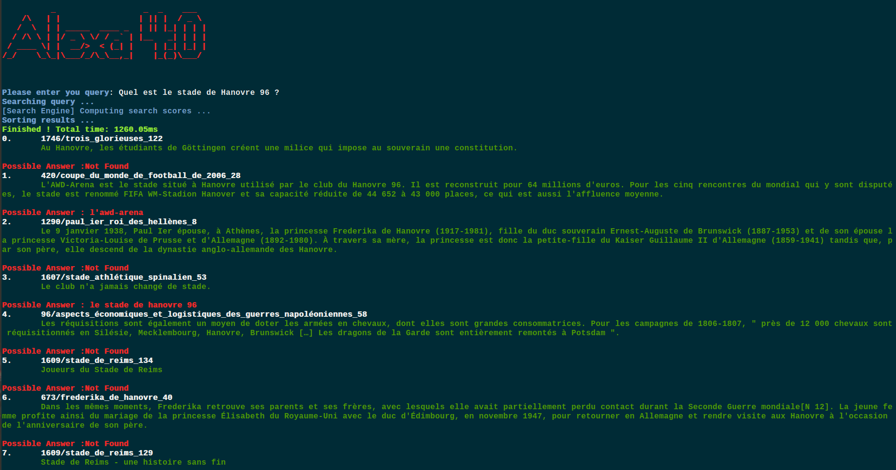

# Open Domain Question Answering Model
*By Quentin Churet, Boris Tronch and Jiahao Lu (CentraleSupélec) -- coordinated by Martin d'Hoffschmidt (Illuin
Technology)*

The goal of this project is to create an open-domain question answering platform, allowing the user to create a turnkey
search engine, that will try to answer to the question given the paragraphs that appears in results.

This project is the result of 1 year of school project in collaboration with CentraleSupélec and Illuin Technology.



## Setting up the project

### Creating a virtual environnement

After cloning the repository, it is highly recommended to install a virtual environment (such as virtualenv) or Anaconda
to isolate the dependencies of this project with other system dependencies.

To install virtualenv, simply run:

```shell script
$ pip install virtualenv
```

Once installed, a new virtual environnement can be created by running:

```shell script
$ virtualenv venv
```

This will create a virtual environment in the venv directory in the current working directory. To change the location
and/or name of the environment directory, change venv to the desired path in the command above.

To enter the virtual environment, run:

```shell script
(venv) $ deactivate
```

### Installing Depedencies

While the virtual environment is active, install the required dependencies by running:

```shell script
(venv) $ pip install -r requirements.txt
```
This will install all of the dependencies at specific versions to ensure they are compatible with one another.

### Load the FQuAD data

In order to make the data accessible by the models, we need to transform the FQuAD data into the data folder.

You can do it by running :

```shell script
(venv) $ python process_fquad_data.py
```

### Load the Wikipedia data

In order to make the data accessible by the models, we need to transform the Wikipedia data into the data folder.

You can do it by running

```shell script
(venv) $ python process_wikipedia_data
```

### Launching the interface !

The interface has multiple parameters, but it has already in default the best parameters.

#### Command to launch the interface on the FQuaD data :

**Make sure you loaded the data as described above !!!!**

```shell script
(venv) $ python interface.py --count 10 \
          --weighting_model okapi-bm25 \
          --lemmatizer spacy-fr \
          --context_retrieval False \
          --question_answering_label camembert-fquad
```

#### Command to launch the interface on the Wikipedia data :

**Make sure you loaded the data as described above !!!!**

First, you need to download the Camembert model fine-tuned on 13 000 questions generated on this corpus.
The models is available [here](https://drive.google.com/file/d/1d3e3WtO3xMz79k3S8vKrvQ9YWj3qgd7K/view?usp=sharing)

Then you need to put the folder unzip in the working directory.

Then, run the following command :

```shell script
(venv) $ python interface.py --count 10 \
          --weighting_model okapi-bm25 \
          --lemmatizer spacy-fr \
          --context_retrieval False \
          --question_answering_label ./camembert_fine_tuned_13000_questions
```